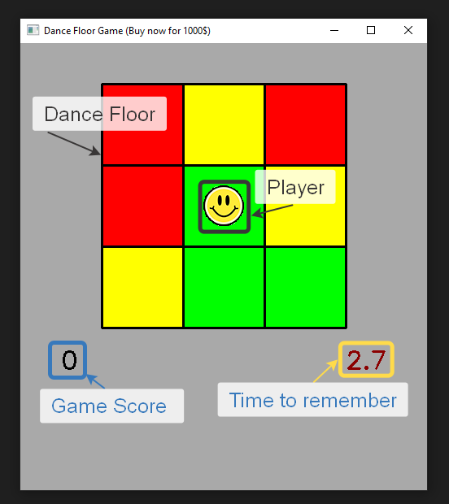
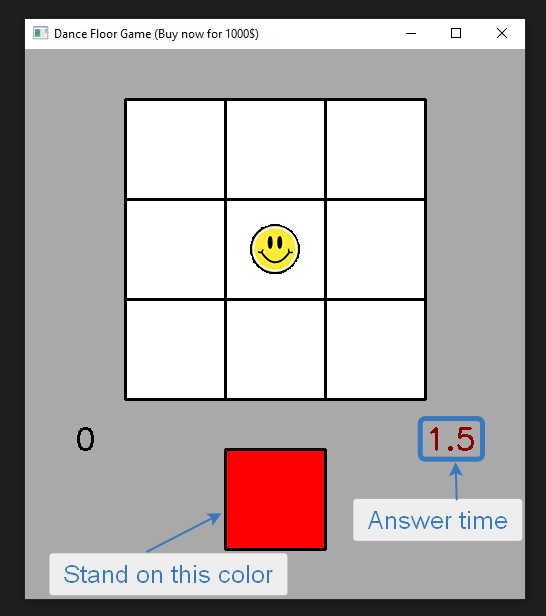
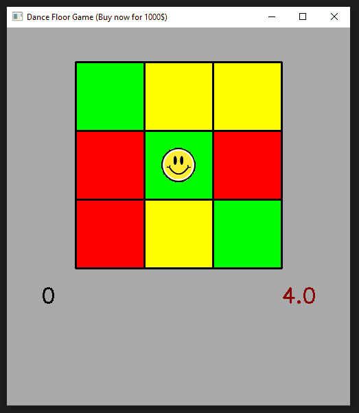

## Задание 1: игра через OpenCV

#### Игра *"Танцплощадка"*:

За отведённое время игрок должен заполнить расположение цветов на танцевальной площадке. Таймер отображается под танцполом.

По истечении времени цвета танцпола прячутся, снизу отображается желаемый цвет.

За отведенное время игрок должен расположить игрового персонажа на ячейке, которая имела указанный цвет. Если игрок правильно выбрал ячейку - танцпол снова закрашивается, и начинается новый раунд. Число выигранных раундов отображается слева под танцполом.

#### Управление:

- WASD / Стрелки: для перемещения.
- Q / Esc: для выхода из игры.
- R: для перезапуска игры при проигрыше.

#### Реализованные требования:

1. Модель персонажа является png картинкой, которая загружается и накладывается с учётом альфа канала поверх изображения танцплощадки.
2. Многослойное изображение с динамическим фоном, поверх которого согласно заданному расположению рисуются другие части игры (таймеры, танцплощадка и т.п.)
3. Управление персонажем с помощью клавиатуры.
4. Рисование сетки танцпола, квадратных ячеек танцпола.
5. Отображение числа очков и таймера в текстовом виде поверх фона.
6. Вся работа GUI реализована с помощью OpenCV.
