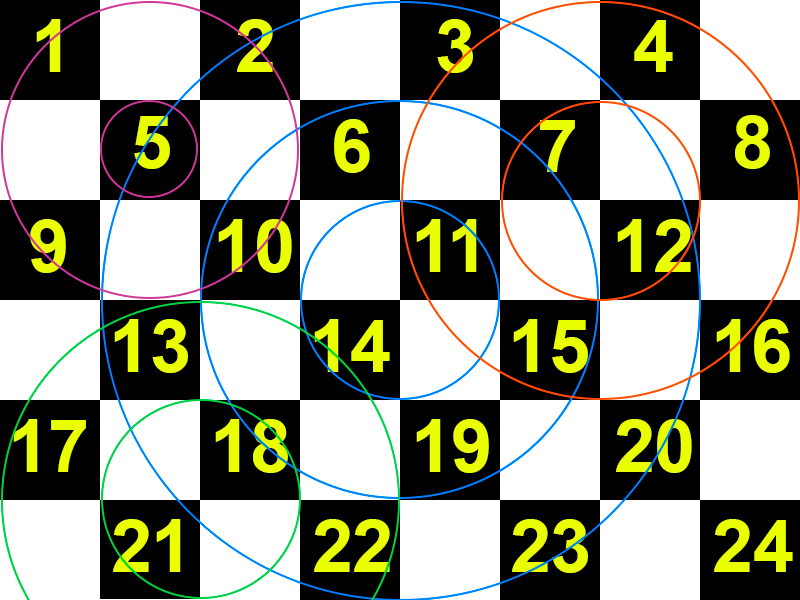
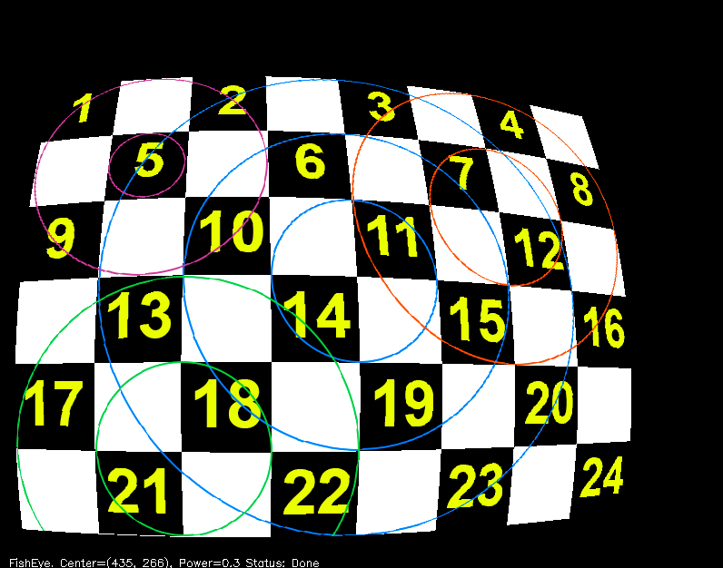
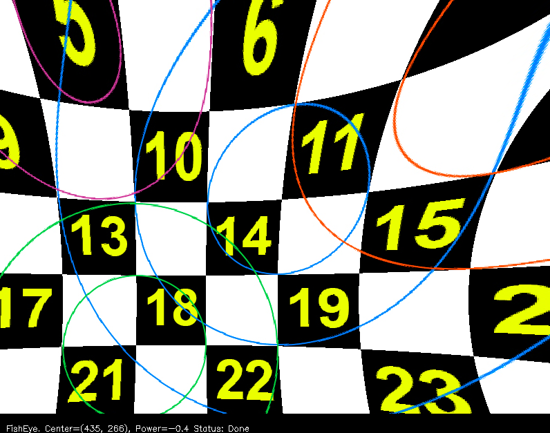
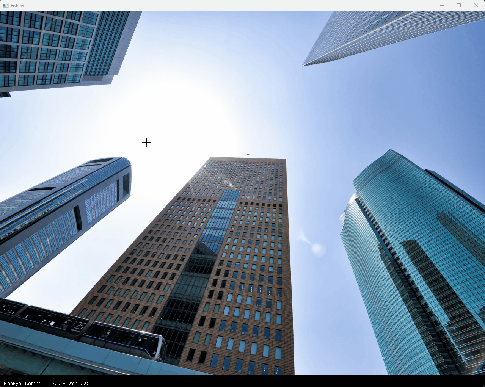

## Задание 2: Эффект на изображении/видео

### Эффект "Fisheye":

Реализовано искажение изображения путем симуляции съемки через объектив с выпуклой сферической линзой "Fisheye", использована документация из [страницы opencv](https://docs.opencv.org/4.x/d9/d0c/group__calib3d.html) и [лекций по моделированию камеры](https://www.cse.psu.edu/~rtc12/CSE486/lecture12.pdf). Процесс преобразования распараллелен с использованием multiprocess.

#### Управление:

- '+': увеличить искажение на 0.1 (10 max).
- '-': уменьшить искажение на 0.1 (-1 min).
- 'Enter': запуск преобразования изображения.
- 'Лкм': выбрать центр трансформации.
- 'Пкм': сбросить настройки искажения.
- 'Q'/'Esc': выход из приложения.

#### Демонстрация:

До:

После:

#### Реализованные требования:

1. Применение преобразования к изображению.
2. На вход можно подать произвольное изображение (BW, RGB, RGBA).
3. Интерактивная настройка центра трансформации мышкой и силы искажения клавишами.