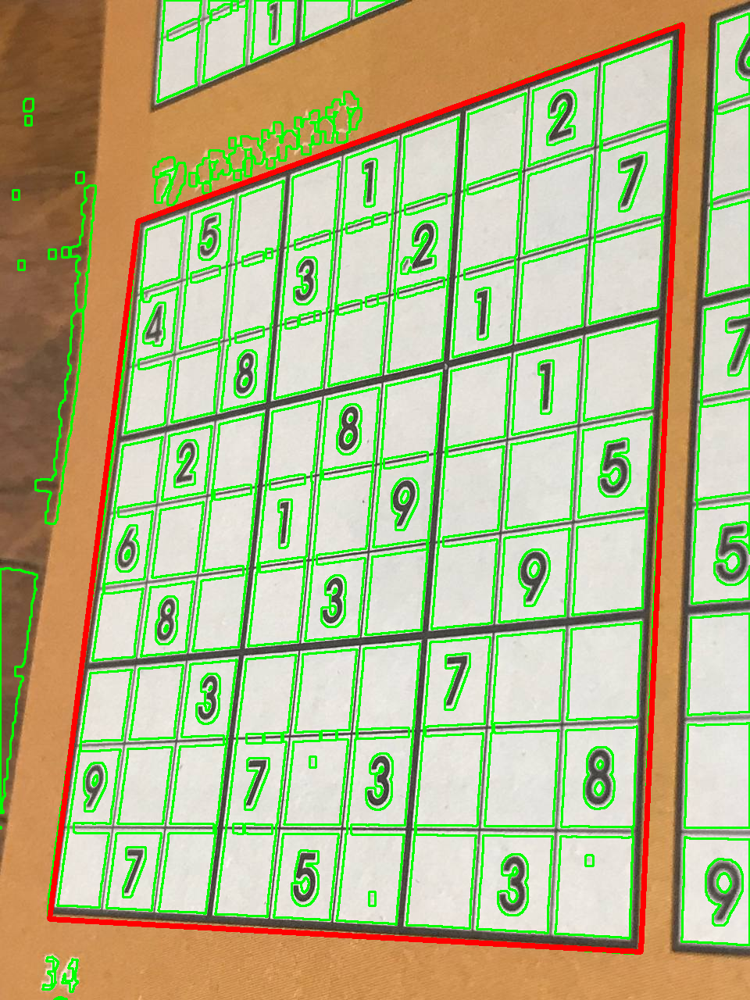

## Задание 4

### Постановка задачи

На вход подается изображение с незаполненной доской судоку. Требуется:

1. Выявить **контур** доски на изображении.
2. Построить матрицу для **калибровки** изображения: после калибровки должен получиться "вид сверху" на судоку. Выполнить калибровку камеры.
3. Определить пустые и заполненные числами ячейки: использовать **шаблоны цифр** для определения значения ячейки.
4. Решить судоку.
5. Заполнить числами из решения исходное изображение: числа должны располагаться в ячейках и искажены согласно положению судоку на изображении.

### Решение задачи
0. Рассмотрим следующее входное изображение:

    

1. Входное изображение преобразуется: конвертируется в чб, удаляется шум, с помощью опорных шаблонов восстанавливаются элементы сетки:

    

2. Выполняется поиск контуров. Контуры сортируются по площади и анализируются: аппроксимируются многоугольником. Задача обнаружить большой четырехугольник. Самый подходящий считается границей доски судоку.

    
    

3. Полученные углы четырехугольника используются для калибровки камеры: получается вид сверху, где углы доски - углы изображения.

    

4. Изображение делится на 81 часть, в каждой ячейке определяется цифра (или пустота). Число определяется путем применение шаблона: т.к. размер ячейки в пикселях определяется достаточно точно, то можно удобно масштабировать шаблон и не искать его с учетом гомотетии. Примеры вырезанных ячеек и найденных цифр:

    
    

5. Обнаруженные цифры заносятся в таблицу для решения судоку. После зполнения сама судоку решается стандартным рекурсивным методом.

    
    

6. Полученные числа печатаются на трансформированном изображении. Затем, т.к. известно прямое калибровочное отображение, можно построить обратное отображение и "вклеить" доску обратно.

    

### Примеры

### Реализованные требования:

1. Поиск и обработка контуров, учет морфологии объекта.
2. Калибровка камеры, прямое и обратное преобразование по опорным точкам.
3. Поиск шаблона в выбранном изображении, учет соотношения размеров.